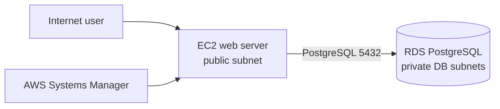

# RCE-48 — EC2 Web App + Private PostgreSQL

A Terraform lab for a classic AWS web-application foundation: compute is separated from the database, and the database is not internet-reachable.

## Architecture

## What is implemented

- A dedicated VPC with one public subnet for the EC2 application host and two private database subnets in separate Availability Zones.
- An EC2 instance running Amazon Linux 2023, with an IAM role for Systems Manager Session Manager access.
- A PostgreSQL RDS instance with storage encryption and `publicly_accessible = false`.
- Security groups that allow PostgreSQL traffic only from the EC2 security group — not from the internet or an arbitrary CIDR block.
- Terraform-managed networking, instance, database, IAM, and security-group resources.
- A generated database password for the lab deployment.

## Engineering decisions

| Decision | Why it matters |
| --- | --- |
| Database in private DB subnets | Reduces the public attack surface. |
| Security-group-to-security-group access | The database rule follows the workload identity instead of trusting a broad network range. |
| Systems Manager instead of an SSH ingress rule | Supports controlled administration without opening port 22 to the internet. |
| Infrastructure as Code | Makes the environment reviewable and repeatable. |

## Validation checklist

After applying Terraform, I would verify:

1. The EC2 instance is reachable through Session Manager.
2. The RDS endpoint cannot be reached directly from the public internet.
3. The application host can establish a PostgreSQL connection on port 5432.
4. The RDS security group has no public PostgreSQL ingress.
5. `terraform destroy` removes the lab resources after testing.

## Deliberate lab trade-offs

This is a cost-conscious learning environment, not a production template. The current configuration keeps RDS Multi-AZ disabled, retains no automated backup window, and skips the final snapshot on deletion. The generated database password is also passed to the instance bootstrap for lab simplicity.

For production I would move secrets to AWS Secrets Manager with rotation, enable backups and deletion protection, use Multi-AZ when the availability target requires it, put an ALB and an Auto Scaling Group in front of the application, and document recovery objectives.

## 30-second interview story

> I built a Terraform-managed EC2 and RDS baseline to demonstrate a traditional web architecture. The important control was not just creating the services: the database is private, encrypted, and only accepts PostgreSQL traffic from the application security group. I used Systems Manager for host access rather than exposing SSH. I also documented the lab-versus-production trade-offs around secrets, backups, and availability.

## Cost and cleanup

RDS and EC2 can incur charges while running. Run `terraform destroy` after testing and confirm that the DB instance, EC2 instance, VPC resources, and security groups were removed.