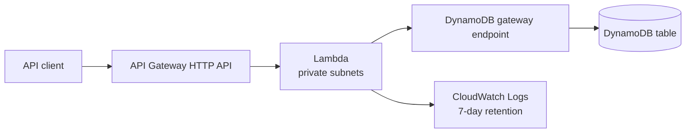

# RCE-49 — Serverless API Backend

A Terraform lab for a small HTTP API built from API Gateway, Lambda, and DynamoDB. It demonstrates serverless request handling with a private network path to the data layer.

## Architecture

## What is implemented

- API Gateway HTTP API routes: `GET /health`, `GET /items`, and `POST /items`.
- A Python 3.13 Lambda function running in private subnets.
- A DynamoDB table with server-side encryption and deliberately small provisioned read/write capacity for the lab.
- A gateway VPC endpoint for DynamoDB, attached to the private route table.
- Lambda IAM permissions restricted to the table actions the implementation needs: `GetItem`, `PutItem`, and `Scan`.
- A dedicated CloudWatch log group with seven-day retention.
- Terraform-managed API, network, IAM, compute, logging, endpoint, and database resources.

## Why the design is useful

| Decision | Why it matters |
| --- | --- |
| API Gateway in front of Lambda | Separates the public HTTP surface from application execution. |
| Lambda in private subnets | Keeps application compute out of the public network path. |
| DynamoDB gateway endpoint | Lets the Lambda reach DynamoDB without a NAT gateway for this traffic. |
| Least-privilege table actions | Makes the Lambda role easier to review and limits blast radius. |
| Short log retention | Keeps diagnostic evidence while controlling lab cost. |

## Validation checklist

1. Call `GET /health` and confirm a successful response.
2. Create an item with `POST /items`, then retrieve it with `GET /items`.
3. Confirm Lambda logs are written to the dedicated CloudWatch log group.
4. Review the Lambda execution role and verify that it does not have broad DynamoDB access.
5. Confirm the private route table is associated with the DynamoDB gateway endpoint.
6. Run `terraform destroy` after the test.

## Production hardening next

- Add authentication and authorization (for example JWT/OIDC or IAM, depending on the client).
- Define API throttling, structured request logging, dashboards, and alarms.
- Enable DynamoDB point-in-time recovery when the recovery requirement justifies it.
- Add an endpoint policy and tighten data access further if the workload grows.
- Use a more explicit API contract, validation, and error-handling strategy.

## 30-second interview story

> I chose a serverless API for an event-sized workload where I did not want to operate a web server. The API Gateway routes invoke a Lambda in private subnets, and the function reaches DynamoDB through a gateway endpoint rather than through a NAT path. I restricted the Lambda role to the exact table actions used by the API and kept log retention short for a cost-aware lab. Next I would add authentication, throttling, observability, and recovery controls.

## Cost and cleanup

The lab uses small serverless resources, but they should still be removed when no longer needed. Run `terraform destroy` and confirm that the API, Lambda, DynamoDB table, log group, VPC endpoint, and networking resources are gone.