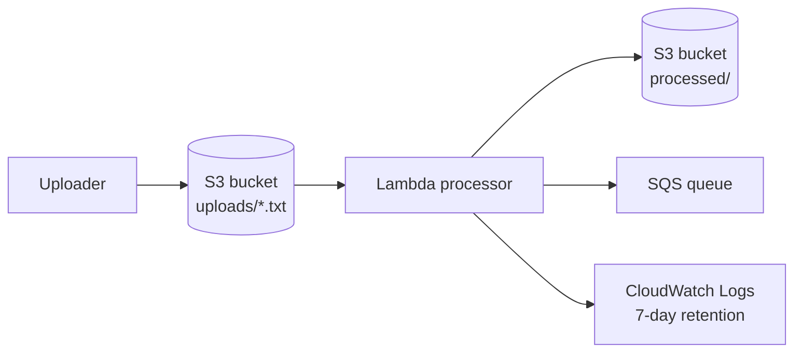

# RCE-50 — Event-Driven File Processing

A Terraform lab for automatically processing uploaded text files. S3 events invoke Lambda, which writes a processed object and emits a message to SQS.

## Architecture

## What is implemented

- A private S3 bucket with bucket-owner-enforced object ownership and server-side encryption.
- An S3 event notification that invokes Lambda only for objects under the `uploads/` prefix with a `.txt` suffix.
- A Lambda function with permissions restricted to read from `uploads/`, write to `processed/`, and send messages to the queue.
- An SQS queue for the asynchronous result/message path.
- A dedicated CloudWatch log group with seven-day retention.
- Terraform-managed bucket policy, notification permission, Lambda, queue, IAM, and observability resources.

## Engineering decisions

| Decision | Why it matters |
| --- | --- |
| Prefix and suffix event filter | Prevents unrelated objects from invoking the function. |
| Separate upload and processed prefixes | Makes the data flow clear and avoids an accidental recursive trigger. |
| SQS message after processing | Decouples downstream work from the file-processing function. |
| Prefix-level IAM permissions | Reduces the function’s access to only the required data paths. |
| Private, encrypted bucket | Keeps uploaded material out of public object storage. |

## Validation checklist

1. Upload a small `.txt` file to the `uploads/` prefix.
2. Confirm that Lambda is invoked and logs are present.
3. Check that the expected result is written under `processed/`.
4. Inspect the SQS queue for the resulting message.
5. Upload a file outside the allowed prefix or suffix and confirm it does not trigger the processor.
6. Run `terraform destroy` after testing.

## Production hardening next

- Add a dead-letter queue and an explicit retry/replay procedure.
- Make processing idempotent so duplicate S3 event delivery is safe.
- Add object validation, malware/content scanning, and a clearer schema contract if inputs become untrusted.
- Emit metrics and alarms for processing failures, queue depth, and age of the oldest message.
- Use SNS fan-out only if multiple independent consumers need the result; this implementation intentionally uses SQS.

## 30-second interview story

> I built an asynchronous file-processing path rather than polling S3 or keeping a server running. S3 invokes the processor only for `uploads/*.txt`, Lambda writes results to a separate prefix, and the next stage receives an SQS message. I used path-level IAM permissions and called out idempotency, retries, and a DLQ as the next production concerns.

## Cost and cleanup

Empty the bucket before destruction if objects remain, then run `terraform destroy`. Verify that the Lambda, queue, log group, bucket notification, and bucket are removed.