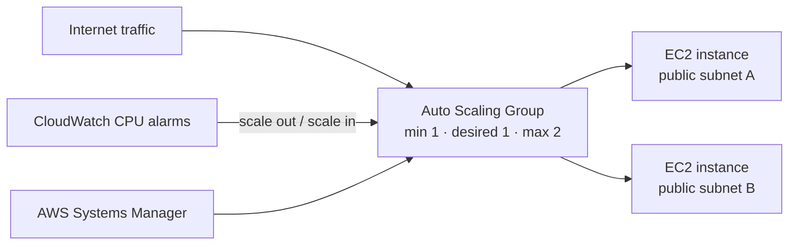

# RCE-51 — EC2 Auto Scaling

A Terraform lab that shows how EC2 capacity can grow and shrink from CloudWatch CPU alarms. It focuses on a repeatable launch configuration and the operational mechanics of an Auto Scaling Group.

## Architecture

## What is implemented

- A VPC with two public subnets in separate Availability Zones and an Internet Gateway.
- An EC2 launch template using a small instance type and Amazon Linux, with an IAM role for Systems Manager access.
- An Auto Scaling Group with EC2 health checks, minimum capacity of 1, desired capacity of 1, and maximum capacity of 2.
- A CPU-high alarm that adds capacity at 70% or above and a CPU-low alarm that removes capacity at 20% or below.
- Terraform-managed networking, launch template, IAM, alarms, and Auto Scaling resources.

## Design decisions

| Decision | Why it matters |
| --- | --- |
| Launch template | Ensures every replacement instance starts from the same versioned configuration. |
| Two Availability Zones | Gives the group placement options rather than anchoring it to one subnet. |
| EC2 health checks | Lets the group replace an unhealthy instance at the infrastructure layer. |
| Separate scale-out and scale-in thresholds | Avoids a single alarm trying to solve both capacity directions. |
| Systems Manager role | Allows operational access without a public SSH rule. |

## Validation checklist

1. Confirm that the group initially maintains one healthy instance.
2. Generate controlled CPU load and observe the scale-out alarm and activity history.
3. Remove the load and observe the low-CPU policy return capacity toward the minimum.
4. Terminate an instance intentionally in a lab environment and confirm that the Auto Scaling Group replaces it.
5. Review the launch template, alarm thresholds, and group activity history.
6. Run `terraform destroy` after testing.

## Deliberate lab boundary

This lab does **not** include an Application Load Balancer. Instances use public subnets so the scaling mechanics can be studied with a small footprint. For a production web service I would place instances in private subnets behind an ALB, use ALB target health checks, use target-tracking or request-based scaling where appropriate, and add dashboards, alarms, and deployment controls.

## 30-second interview story

> I built a small Auto Scaling Group to demonstrate that scaling is a control loop, not simply a second EC2 instance. The launch template makes replacement instances consistent, CloudWatch high/low CPU alarms drive capacity changes, and the group maintains a minimum healthy baseline. I was explicit that a real public web service would put private instances behind an ALB and use application-level health checks.

## Cost and cleanup

Auto Scaling can create replacement or additional EC2 instances during testing. Before teardown, set expectations around the desired capacity, then run `terraform destroy` and confirm that the group, launch template, alarms, instances, and network resources are removed.