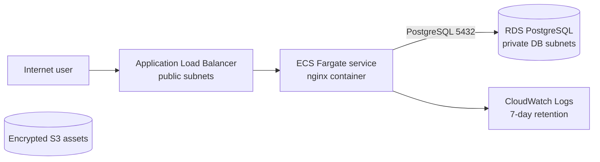

# RCE-52 — ECS Fargate + ALB + Private RDS

A Terraform lab for a containerized web-service architecture. It combines an internet-facing Application Load Balancer, an ECS Fargate service, a private PostgreSQL database, encrypted object storage, and CloudWatch logging.

## Architecture

## What is implemented

- Reusable Terraform modules for networking, the Fargate application, and the data layer.
- A VPC with two public and two private subnets across two Availability Zones.
- An internet-facing ALB with an HTTP listener and target health checks.
- An ECS cluster, Fargate task definition, and ECS service running a small nginx container image.
- Security groups that allow the service to receive traffic only from the ALB and allow PostgreSQL access only from the ECS task security group.
- A private RDS PostgreSQL instance in database subnets with storage encryption.
- An encrypted S3 assets bucket with public access blocked and bucket-owner-enforced ownership.
- A dedicated CloudWatch log group with seven-day retention.

## Engineering decisions

| Decision | Why it matters |
| --- | --- |
| ALB in front of ECS | Provides a stable public entry point and health-check boundary. |
| Task-to-database security-group rule | Keeps database access tied to the workload rather than an open CIDR range. |
| Separate Terraform modules | Makes network, service, and data responsibilities easier to review and evolve. |
| Encrypted, private RDS and S3 | Establishes secure defaults for stored data. |
| Short log retention | Keeps operational evidence while limiting the cost of a learning environment. |

## Validation checklist

1. Apply the Terraform configuration and retrieve the ALB DNS name from the outputs.
2. Confirm the ALB target is healthy and the service returns the expected nginx response.
3. Verify that the ECS task security group has no direct public ingress.
4. Confirm that the RDS instance is not publicly accessible and accepts PostgreSQL only from the ECS task security group.
5. Inspect the CloudWatch log group and ECS service events.
6. Run `terraform destroy` after the test and confirm the ALB, service, database, and VPC resources are removed.

## Deliberate lab trade-offs and production path

The service currently assigns public IPs to Fargate tasks in public subnets to keep the lab network simple. The RDS instance has Multi-AZ, backups, deletion protection, and final snapshots disabled for cost-conscious experimentation. The task image is a public nginx image, and the database password is generated for the Terraform deployment.

For a production workload I would run the tasks in private subnets, use NAT or VPC endpoints only where justified, store credentials in Secrets Manager, enable the database recovery controls that match the RTO/RPO, use a private image supply chain (for example ECR), add ECS service autoscaling, HTTPS with ACM, WAF where appropriate, and a controlled deployment strategy such as blue/green.

## 30-second interview story

> I built a modular ECS Fargate architecture where the ALB owns the public entry point, the task only trusts the ALB security group, and the RDS database only trusts the task security group. I deliberately kept a few settings cheap for the lab, then documented the concrete changes I would make for production: private task networking, secrets management, durable RDS settings, observability, and a safer deployment path.

## Cost and cleanup

The ALB, Fargate tasks, and RDS instance can generate cost while active. Destroy the stack immediately after validation and check that the ECS service, ALB, target group, database, S3 bucket contents, log group, and network resources are gone.