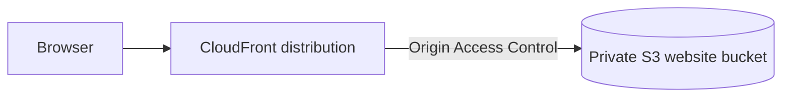

# RCE-47 — Private S3 Static Website + CloudFront

A Terraform lab for delivering a static website securely without making the S3 bucket public. CloudFront is the public edge, and Origin Access Control is the only permitted path to the bucket.

## Architecture

## What is implemented

- A dedicated S3 bucket for the static site with public access blocked.
- Bucket-owner-enforced object ownership and default server-side encryption.
- A CloudFront distribution with the S3 bucket as its origin.
- Origin Access Control (OAC) between CloudFront and S3.
- A bucket policy that permits reads from the CloudFront service only for the specific distribution source ARN.
- Viewer HTTP-to-HTTPS redirect and normal CloudFront caching behaviour.
- Terraform-managed upload and delivery infrastructure.

## Why this is stronger than a public S3 website bucket

| Decision | Why it matters |
| --- | --- |
| Public access block enabled | Prevents direct public access to the bucket. |
| CloudFront OAC | Gives CloudFront a controlled identity for reading the origin. |
| Distribution-specific bucket policy | Avoids granting broad anonymous S3 read access. |
| HTTPS redirect | Protects users from unencrypted viewer traffic. |
| Terraform | Makes the security controls reviewable and repeatable. |

## Validation checklist

1. Upload the site content through the Terraform configuration.
2. Open the CloudFront distribution domain and confirm the page is served.
3. Request the HTTP URL and confirm it redirects to HTTPS.
4. Attempt to access a known S3 object directly and confirm that it is not publicly readable.
5. Confirm the bucket policy references the intended CloudFront distribution source ARN.
6. After the CloudFront deployment completes, run `terraform destroy` and verify the bucket is empty before deletion.

## Production hardening next

- Add a custom domain with ACM-managed TLS certificates.
- Add Route 53 DNS records and a cache invalidation deployment step.
- Introduce WAF only when the exposure and threat model justify it.
- Add security headers, monitoring, and an explicit release/rollback plan.
- Put build and content validation into CI/CD before publishing.

## 30-second interview story

> I used private S3 plus CloudFront OAC instead of a public S3 bucket because the CDN should be the only public delivery layer. The bucket policy restricts reads to the specific CloudFront distribution, and HTTP viewers are redirected to HTTPS. The next production steps would be custom DNS and certificates, release automation, and only then security controls such as WAF if the threat model needs them.

## Cost and cleanup

CloudFront changes can take time to deploy or remove. After validation, empty the bucket if required, run `terraform destroy`, and verify that both the distribution and bucket were removed.